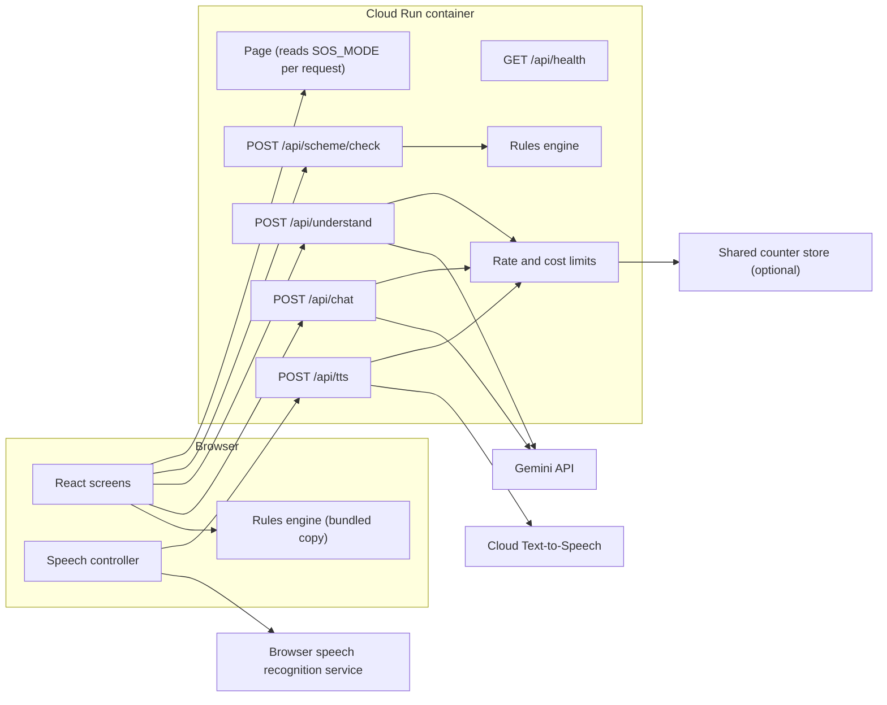
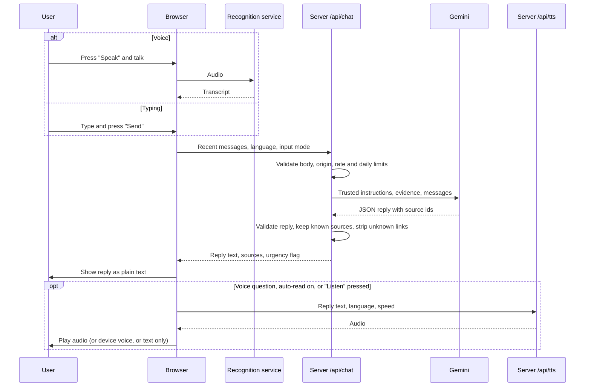
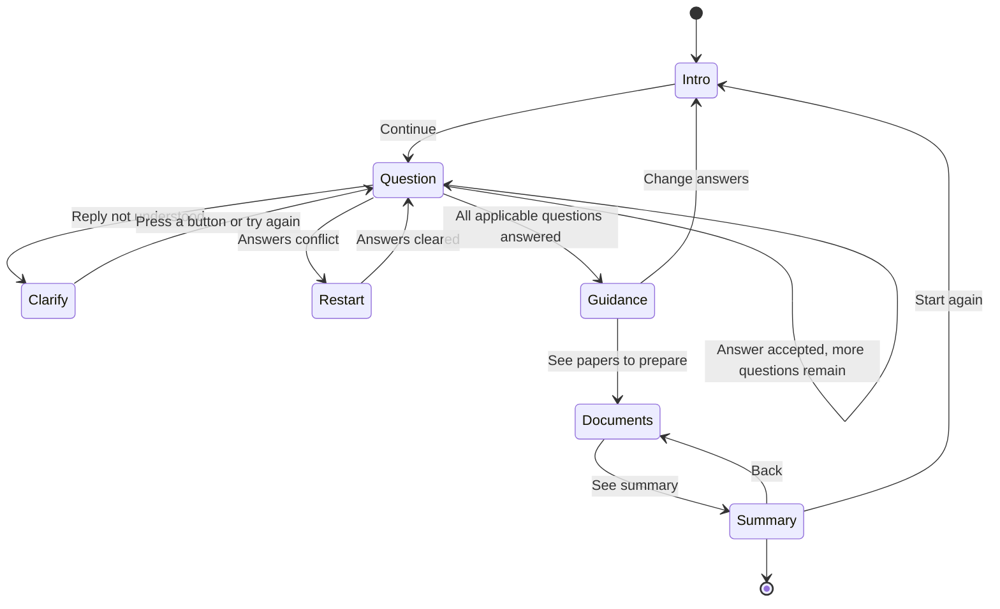
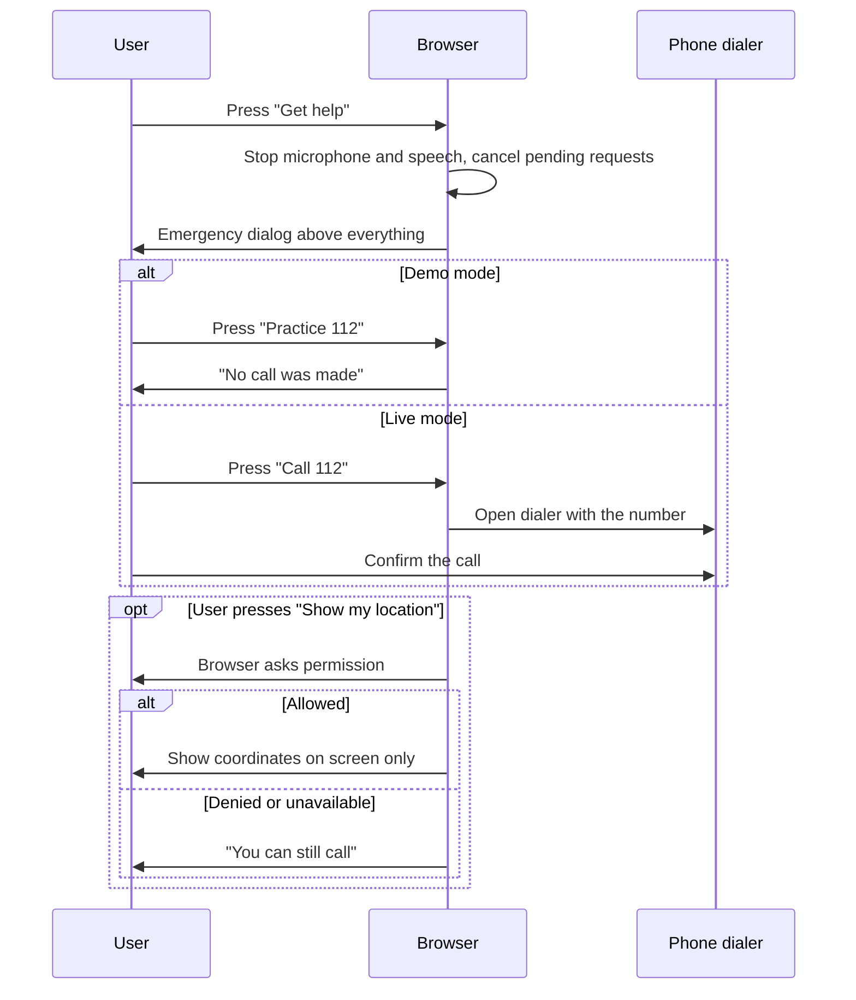
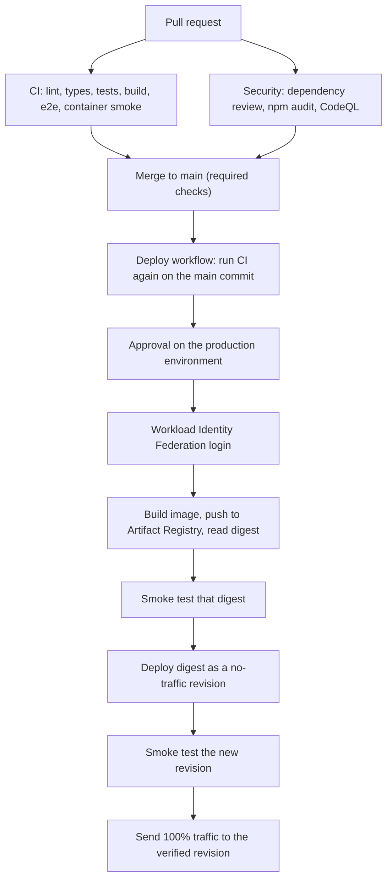
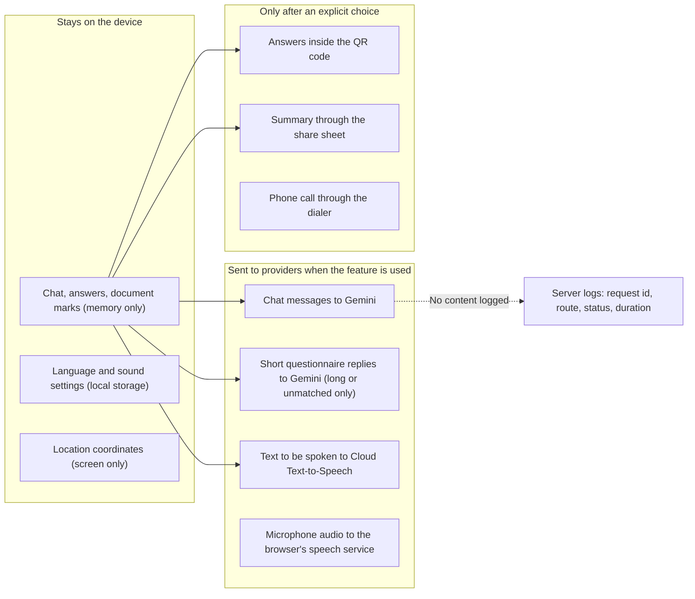

# Sakho AI

Sakho AI is a multilingual, voice-first web assistant for women in rural India. A user can **speak, type, or tap large buttons** to:

- ask a question and get a short, spoken answer from a Gemini-powered assistant;
- answer a few questions about the **Pradhan Mantri Matru Vandana Yojana (PMMVY)** maternity benefit and get early, clearly labelled guidance plus a checklist of papers to prepare;
- open **emergency phone numbers** from any screen.

No login is needed. The guided flow works without the microphone, without AI, and, once the page has loaded, without a connection.

> **What Sakho AI is not.** It is not a government office, a doctor, or an emergency service. It never says a user "is eligible", it cannot place calls or watch for emergencies, and its benefit rules are a **draft** transcribed from official text that no official has reviewed. See [Known limitations](#known-limitations).

## Contents

[Feature status](#feature-status) · [Screens and journeys](#screens-and-journeys) · [Prerequisites](#prerequisites) · [Quick start](#quick-start) · [Environment variables](#environment-variables) · [Provider setup](#provider-setup) · [API reference](#api-reference) · [Architecture](#architecture) · [Languages](#languages) · [Rule provenance](#rule-provenance) · [Privacy and safety](#privacy-and-safety) · [Testing](#testing) · [Accessibility](#accessibility) · [Deployment](#deployment) · [GitHub setup](#github-setup) · [Operations](#operations) · [Troubleshooting](#troubleshooting) · [Demo guide](#demo-guide) · [Known limitations](#known-limitations)

## Feature status

| Capability | Status | Notes |
|---|---|---|
| Guided PMMVY questionnaire, result, documents, summary | Implemented | Driven by `POST /api/scheme/check`. Same engine is bundled for offline fallback. |
| PMMVY rules | **Unverified draft** | Transcribed from the official FAQ on 2026-10-01. Not reviewed by an official. Output is always "early guidance". |
| AI chat (typed) | Implemented | Real Gemini call when `GEMINI_API_KEY` is set. Verified in this repository only against mocks; see [Testing](#testing). |
| AI chat (voice in, spoken reply) | Implemented | Needs a browser with speech recognition. Not yet tested on real phones. |
| Cloud Text-to-Speech with device-voice fallback | Implemented | Per-language voice availability is **unverified**; run `npm run check:providers`. |
| Interpreting spoken/typed questionnaire answers | Implemented | Keyword lists for English, Hindi, Tamil; Gemini for longer replies when configured. |
| Emergency help | Implemented, **demo by default** | Three numbers verified on official pages. Live dialer links only when `SOS_MODE=live`. |
| English interface | Implemented | Source language. |
| Hindi and Tamil interface | Implemented, **needs fluent review** | Complete, but written for this build and not yet checked by a fluent speaker. |
| Ten other languages | **Preview** | Selectable; screens stay in English; the assistant is asked to reply in the language. |
| Rate limiting and daily cost cap | Implemented | Shared across instances only when a Redis REST store is configured. |
| Docker image and Cloud Run workflow | Implemented | Not deployed from this repository yet. See the final section of [Deployment](#deployment). |
| Offline reload / installable app | **Not implemented** | There is no service worker. A page already open keeps working in a reduced way. |
| Other schemes, accounts, saved history | Planned / out of scope | No database is used. |

## Screens and journeys

| Screen | What the user can do |
|---|---|
| Language | Pick one of 13 languages shown in their own script. Each shows an honest label: Full, Needs review, or Preview. "Hear greeting" plays a greeting. Nothing is saved until "Continue". |
| Introduction (optional) | Three short illustrated steps with Back, Next, Skip, and a "Get help" button inside the dialog. |
| Home | Three large entries: Ask Sakho AI, Check benefits, Get help. |
| Ask (chat) | Type or press "Speak". Replies appear as text with "Listen" / "Stop". "Try again" resends a failed question. "Start new conversation" clears context. |
| Check benefits | One question per screen with large labelled answers, "Listen again", a typed or spoken answer, progress, and Back. |
| Early guidance | One of: answers match the published conditions / may not apply / cannot tell. Always states it is not an approval, shows next steps, sources and rule version. |
| Papers to prepare | Each document can be marked "Have it" or "Need help"; unmarked stays "Not marked". |
| Summary | Answers, papers, guidance, sources, a QR code and optional sharing. |
| Emergency help | Opens above everything. Three numbers, an explicit demo/live banner, and optional "Show my location". |
| Settings | Language, speaking speed, auto-read, privacy explanation, "Erase my chat and answers", replay the introduction. |

A red **Get help** button (icon plus text) is in the header on every screen and inside every dialog.

## Prerequisites

| Requirement | Version | Why |
|---|---|---|
| Node.js | 24 LTS (>= 24.15) | Active LTS. `jsdom` 30 needs >= 24.15. Pinned in `.nvmrc`, `package.json` `engines`, CI and the Dockerfile. |
| npm | 11 (ships with Node 24) | `package-lock.json` is committed; CI and Docker use `npm ci`. |
| Browser | Recent Chrome, Edge, Firefox or Safari | Voice input needs `SpeechRecognition` (Chrome/Edge on Android and desktop; Safari partially). Without it, typing and buttons still work. |
| HTTPS or `localhost` | n/a | Browsers only allow the microphone and location on secure origins. |
| Docker | 24+ | Only for container builds. |
| Google Cloud project, `gcloud` | current | Only for deployment and Cloud Text-to-Speech. |

### Why these dependency versions

Versions were chosen for mutual compatibility on 2026-10-01, not simply "latest":

| Package | Version | Reason |
|---|---|---|
| `next` / `react` | 16.3.8 / 19.3.0 | Current stable App Router. |
| `typescript` | 6.0.3 | TypeScript 7 is the newest release, but `typescript-eslint` (used by `eslint-config-next`) supports `< 6.1`. |
| `eslint` | 9.39.5 | ESLint 10 exists, but `eslint-plugin-jsx-a11y` and `eslint-plugin-import` support up to 9. |
| `@google/genai` | 2.25.0 | Official Google Gen AI SDK. |
| `google-auth-library` | 11.1.0 | Access tokens for the Cloud Text-to-Speech REST API (lighter than the gRPC client). |
| `zod` | 4.6.5 | Runtime validation at every API boundary. |
| `tailwindcss` | 4.3.3 | Design tokens live in `src/app/globals.css`. |
| `vitest` / `@playwright/test` | 5.0.3 / 1.63.0 | Unit/component and end-to-end runners. |

Dependabot is configured not to propose the TypeScript and ESLint majors until the tooling supports them.

## Quick start

```bash
git clone https://github.com/abishekss2007/Sakho-AI.git
cd Sakho-AI
npm ci
cp .env.example .env.local
npm run dev
```

Open <http://localhost:3000>. With an empty `.env.local` everything works except real AI answers and cloud speech (chat shows "not available"; "Listen" uses a device voice if one exists).

To try the whole app without any credentials, use the mock providers:

```bash
SAKHO_MOCK_PROVIDERS=true npm run dev
```

Production mode, exactly as the container runs it:

```bash
npm run build
npm run start
```

`npm run start` serves the standalone build on `PORT` (default 3000).

> **Windows + OneDrive:** the project builds inside a OneDrive folder, but OneDrive can lock build output. `npm run build` first runs `scripts/clean.mjs` to work around that. If builds still fail with `EPERM`, move the project outside OneDrive.

## Environment variables

**No variable is public.** The app uses no `NEXT_PUBLIC_*` values, so nothing is inlined at build time and one image serves every environment. All values are read by the server at request time.

| Variable | Scope | Required | Default | Purpose |
|---|---|---|---|---|
| `GEMINI_API_KEY` | Server secret | For real chat | unset | Gemini API key. Without it `/api/chat` returns `503 provider_unavailable`. |
| `GEMINI_MODEL` | Server | No | `gemini-3.5-flash-lite` | Model name. See [Provider setup](#provider-setup). |
| `TTS_ENABLED` | Server | No | `false` | `true` enables Cloud Text-to-Speech using Application Default Credentials. |
| `SOS_MODE` | Server | No | `demo` | Only the exact value `live` renders real `tel:` links. |
| `RATE_LIMIT_PER_MINUTE` | Server | No | `12` | Requests per client, per paid endpoint, per minute. |
| `DAILY_PAID_REQUEST_CAP` | Server | No | `2000` | Total paid-endpoint requests per UTC day before `503 budget_exhausted`. |
| `RATE_LIMIT_REDIS_REST_URL` | Server | No | unset | Upstash-compatible Redis REST URL for counters shared across instances. |
| `RATE_LIMIT_REDIS_REST_TOKEN` | Server secret | With the URL | unset | Token for that store. |
| `TRUSTED_PROXY_HOPS` | Server | No | `0` | Proxies in front of the app that append to `X-Forwarded-For`. `0` for Cloud Run directly; `1` behind one external load balancer. |
| `SAKHO_MOCK_PROVIDERS` | Server | No | `false` | `true` replaces Gemini and Cloud TTS with deterministic mocks. For tests and demos only. |
| `PORT`, `HOSTNAME` | Server | No | `3000` / `0.0.0.0` | Listening address. Cloud Run sets `PORT`. |

### Demo/live emergency contract

- The server reads `SOS_MODE` per request and passes it to the page, so the banner the user sees and the links in the page always come from the same value.
- In demo mode the page contains **no `tel:` link at all**; the number buttons only show "No call was made".
- Local development, automated tests, the container default and any deployment without `SOS_MODE=live` are demo.
- `GET /api/health` reports the active mode, and the deploy workflow fails if it does not match what was requested.

## Provider setup

### Gemini

1. Create an API key in Google AI Studio.
2. Local: put it in `.env.local` as `GEMINI_API_KEY`. Production: store it in Secret Manager (see [Deployment](#deployment)). It is only ever read in `src/lib/server/gemini.ts`.
3. Optional: set `GEMINI_MODEL`. The default `gemini-3.5-flash-lite` was listed as a stable, low-cost model on <https://ai.google.dev/gemini-api/docs/models> on 2026-10-01. Model names are retired over time; if the model is unknown the API returns an error and chat shows "not available".
4. Check it for real (this makes one small paid request, and is never run by CI):

```bash
GEMINI_API_KEY=your-key npm run check:providers
```

### Google Cloud Text-to-Speech

1. Enable the Cloud Text-to-Speech API in your project.
2. Local: `gcloud auth application-default login`, then set `TTS_ENABLED=true`. Cloud Run: the attached service account is used automatically. No key file is used anywhere.
3. The app requests audio by language code only (for example `ta-IN`) and lets Google choose the voice, so no voice name is hard-coded.
4. List which of the 13 languages currently have a voice (free call):

```bash
TTS_ENABLED=true npm run check:providers
```

If a language has no cloud voice, or the call fails, the browser's own voice is used when the device has one for that language. If not, the app says so and keeps the text on screen; it never speaks with a voice for a different language.

## API reference

All endpoints are JSON over HTTPS, same-origin only (a request with a foreign `Origin` gets `403 forbidden_origin`), with bodies up to 16 KB. Schemas live in `src/lib/api/contracts.ts` and are enforced on the server and re-validated in the browser. Unknown fields are rejected.

### Error envelope

Every error from every endpoint has this shape, with `Cache-Control: no-store` and an `X-Request-Id` header:

```json
{ "ok": false, "requestId": "5f0c…", "error": { "code": "rate_limited", "message": "Too many requests. Please wait a minute." } }
```

| HTTP | `code` | Meaning |
|---|---|---|
| 400 | `invalid_json`, `invalid_request` | Body is not JSON, or fails validation. The message lists field paths only, never submitted values. |
| 403 | `forbidden_origin` | Request came from another website. |
| 413 | `payload_too_large` | Body over 16 KB. |
| 415 | `unsupported_media_type` | `Content-Type` is not `application/json`. |
| 429 | `rate_limited` | Per-client limit reached. `Retry-After: 60`. |
| 502 | `provider_bad_response` | The provider returned something unusable. |
| 503 | `provider_unavailable`, `provider_rate_limited`, `budget_exhausted` | Provider not configured, down, busy, or the daily cap is reached. |
| 504 | `provider_timeout` | Provider exceeded the time limit (20 s chat, 10 s speech). |
| 500 | `internal_error` | Unexpected failure. |

### `POST /api/scheme/check`

Evaluates answers with the shared rules engine. No provider call, no rate limit.

```json
{ "schemeId": "pmmvy", "answers": { "pregnant_or_recent_birth": "yes", "child_order": "first" } }
```

| Question id | Allowed values | Asked when |
|---|---|---|
| `pregnant_or_recent_birth` | `yes`, `no`, `unsure` | Always |
| `child_order` | `first`, `second`, `third_or_later`, `unsure` | First answer is not `no` |
| `second_child_girl` | `yes`, `no`, `unsure` | `child_order` is `second` |
| `has_category_proof` | `yes`, `no`, `unsure` | No earlier answer already rules the scheme out |

`200` responses carry one of three `result.status` values:

```json
{ "ok": true, "requestId": "…", "result": { "status": "questions_remaining", "nextQuestionId": "has_category_proof", "answered": 2, "total": 3 } }
```

```json
{ "ok": true, "requestId": "…", "result": { "status": "needs_clarification", "conflicts": ["second_child_girl"] } }
```

```json
{
  "ok": true,
  "requestId": "…",
  "result": {
    "status": "review",
    "guidance": "may_apply",
    "reasons": [],
    "uncertainQuestions": [],
    "official": false,
    "requiresOfficialReview": true,
    "rules": { "schemeId": "pmmvy", "ruleVersion": "pmmvy-draft-2026-10-01", "rulesStatus": "draft", "reviewStatus": "not_officially_reviewed", "lastVerified": null, "geographicScope": "…", "sources": [ { "id": "pmmvy_faq", "title": "…", "publisher": "…", "url": "https://…", "retrievedOn": "2026-10-01" } ] }
  }
}
```

`guidance` is `may_apply`, `may_not_apply` (with `reasons`) or `uncertain`. There is no "eligible" value. `official` is always `false`.

### `POST /api/understand`

Turns one spoken or typed reply into a validated answer. The server never applies the answer; the browser does, and only if the echoed `questionId` and `sessionId` still match the question on screen.

```json
{ "schemeId": "pmmvy", "questionId": "child_order", "utterance": "दूसरा बच्चा", "locale": "hi", "sessionId": "a1b2c3d4e5f6" }
```

`utterance` is 1 to 300 characters; `sessionId` is 8 to 64 characters of `A-Z a-z 0-9 _ -`.

```json
{ "ok": true, "requestId": "…", "questionId": "child_order", "sessionId": "a1b2c3d4e5f6", "interpretation": { "kind": "answer", "value": "second" }, "via": "keywords" }
```

`interpretation.kind` is one of `answer` (value is always one of the question's allowed values), `repeat`, `unclear`, or `emergency_suggestion` (with `serviceId` of `erss_112`, `women_181` or `child_1098`). `via` is `keywords` or `model`. Rate limited.

### `POST /api/tts`

```json
{ "text": "வணக்கம்", "locale": "ta", "speed": "slow" }
```

`text` is 1 to 600 characters; `locale` is one of the 13 codes; `speed` is `slow`, `normal` or `fast` (speaking rate 0.8, 1.0, 1.2). Success is `200` with an `audio/mpeg` body (`audio/wav` from the mock provider) and `Cache-Control: no-store`. Errors use the JSON envelope. Rate limited.

### `POST /api/chat`

```json
{
  "messages": [
    { "role": "user", "text": "What papers do I need?" }
  ],
  "locale": "en",
  "inputMode": "text"
}
```

Limits: 1 to 12 messages, each up to 1000 characters, 6000 characters in total, roles `user` or `assistant`, and the last message must be from the user. `inputMode` is `text` or `voice`.

```json
{
  "ok": true,
  "requestId": "…",
  "reply": { "text": "You need your Aadhaar card, …", "language": "en" },
  "sources": [ { "id": "pmmvy_faq", "title": "PMMVY Frequently Asked Questions (FAQs)", "publisher": "…", "url": "https://www.spniwcd.wcd.gov.in/…" } ],
  "safety": { "urgent": false },
  "needsClarification": false,
  "provider": "gemini"
}
```

`sources` only ever contains entries from the server's own registry: the model returns source **ids**, and unknown ids are dropped. Any web address in the reply text that is not in the registry is replaced with `[link removed]`. `safety.urgent` only makes the screen show a "press Get help" prompt; it triggers nothing. Rate limited.

### `GET /api/health`

```json
{ "ok": true, "service": "sakho-ai", "providers": "live", "sosMode": "demo", "rateLimit": "per-instance" }
```

Makes no provider call and exposes no secret or configuration value.

## Architecture



### File map

| Path | Responsibility |
|---|---|
| `src/app/page.tsx`, `layout.tsx` | Server shell. Reads `SOS_MODE` and provider mode per request. |
| `src/app/api/*/route.ts` | Thin route handlers: validate, limit, call one library function. |
| `src/lib/scheme/engine.ts` | **The single rules implementation.** Pure; used by the API and by the offline fallback. |
| `src/lib/scheme/pmmvy.ts` | Draft rules data, sources, provenance, evidence given to the chat model. |
| `src/lib/api/contracts.ts` | Zod schemas for every request and response; error codes. |
| `src/lib/server/gemini.ts` | The only Gemini call site. Lazy client, timeout, error mapping. |
| `src/lib/server/chat.ts` | Trusted system instruction, source validation, URL stripping. |
| `src/lib/server/understand.ts` | Keyword interpretation plus validated model fallback. |
| `src/lib/server/tts.ts` | Cloud Text-to-Speech adapter (REST with ADC token). |
| `src/lib/server/rateLimit.ts` | Per-client and daily counters; memory or Redis REST store. |
| `src/lib/server/http.ts`, `log.ts` | Body limits, origin check, error envelope, metadata-only logging. |
| `src/lib/speech/controller.ts` | One controller for recognition, cloud audio and device speech. |
| `src/lib/emergency.ts` | Verified services, demo/live resolution, assistive urgent-phrase list. |
| `src/lib/languages.ts`, `src/lib/i18n/` | 13 language configs with separate capability flags; en/hi/ta dictionaries. |
| `src/lib/storage.ts`, `share.ts` | Preference storage with legacy migration; sharing and QR content. |
| `src/components/App.tsx` | Client state: screen, preferences, in-memory chat and answers, interruption. |
| `src/components/ui/` | Design system: `Button`, `Card`, `Notice`, `Modal`, `Icon`, `SafeText`. |
| `tests/`, `e2e/` | Vitest suites and Playwright suite. |
| `Dockerfile`, `scripts/smoke.sh` | Image and its smoke test. |
| `.github/` | CI, deploy, security workflows and Dependabot. |

### State boundaries

- **Server:** stateless. The only state is rate-limit counters.
- **Browser memory:** chat messages, questionnaire answers, document marks. Lost on reload by design.
- **Browser storage:** one key, `sakho-ai:prefs:v1`, holding language, speaking speed, auto-read and "introduction seen". The legacy Thozhi tutorial flag is migrated once if present (the original key name was not available, so three likely names are checked).

### Chat sequence



### Questionnaire states



"Guidance" is always preliminary review guidance. There is no "eligible" state.

### Emergency sequence



### CI/CD flow



### Data and privacy flow



## Languages

Four capabilities are tracked separately in `src/lib/languages.ts`; one never implies another.

| Code | Language | Interface text | Speech recognition | Speech synthesis | AI replies |
|---|---|---|---|---|---|
| `en` | English | Complete (source) | Browser-dependent | Unverified | Supported |
| `hi` | Hindi | Complete, **needs fluent review** | Browser-dependent | Unverified | Unreviewed |
| `ta` | Tamil | Complete, **needs fluent review** | Browser-dependent | Unverified | Unreviewed |
| `bn` | Bengali | Preview (English screens) | Browser-dependent | Unverified | Unreviewed |
| `mr` | Marathi | Preview (English screens) | Browser-dependent | Unverified | Unreviewed |
| `te` | Telugu | Preview (English screens) | Browser-dependent | Unverified | Unreviewed |
| `gu` | Gujarati | Preview (English screens) | Browser-dependent | Unverified | Unreviewed |
| `ur` | Urdu | Preview (English screens) | Browser-dependent | Unverified | Unreviewed |
| `kn` | Kannada | Preview (English screens) | Browser-dependent | Unverified | Unreviewed |
| `or` | Odia | Preview (English screens) | Browser-dependent | Unverified | Unreviewed |
| `ml` | Malayalam | Preview (English screens) | Browser-dependent | Unverified | Unreviewed |
| `pa` | Punjabi | Preview (English screens) | Browser-dependent | Unverified | Unreviewed |
| `as` | Assamese | Preview (English screens) | Browser-dependent | Unverified | Unreviewed |

- **Browser-dependent:** recognition is done by the user's browser. Sakho AI cannot guarantee any language.
- **Unverified:** the cloud voice list was not checked from this environment. `npm run check:providers` prints the real answer.
- **Unreviewed:** Gemini is asked to reply in the language; nobody fluent has reviewed the quality.
- The page's `lang` and `dir` describe the text actually shown. A preview language therefore keeps `lang="en"` and left-to-right layout. Chat messages carry their own `lang`/`dir`, so Urdu replies are right-to-left while phone numbers stay left-to-right (`<bdi dir="ltr">`).
- Changing language keeps chat and questionnaire progress.
- To promote a language: add `src/lib/i18n/<code>.ts` implementing every key (a test enforces completeness and placeholders), register it in `src/lib/i18n/index.ts`, and change its `ui` level in `languages.ts`.

## Rule provenance

| Field | Value |
|---|---|
| Scheme | Pradhan Mantri Matru Vandana Yojana (PMMVY 2.0, under Mission Shakti) |
| Rule version | `pmmvy-draft-2026-10-01` |
| Rules status | `draft` |
| Review status | `not_officially_reviewed` |
| Last verified by an authority | never (`lastVerified: null`) |
| Geographic scope | India. The FAQ states the scheme was not being implemented in Telangana and Odisha. |

| Source | Publisher | Retrieved | Used for |
|---|---|---|---|
| [PMMVY FAQs (PDF)](https://www.spniwcd.wcd.gov.in/uploads/pdf/1710098119_HDEXdpWMb1.pdf) | Ministry of Women and Child Development (SPNIWCD) | 2026-10-01 | Categories, amounts, instalments, age range, 270-day registration window, documents, how to apply, Telangana/Odisha note |
| [PMMVY portal](https://pmmvy.wcd.gov.in/) | Ministry of Women and Child Development | 2026-10-01 | Official application address |
| [PMMVY scheme page](https://wcd.gov.in/women/pradhan-mantri-matru-vandana-yojna) | Ministry of Women and Child Development | 2026-10-01 | Scheme description, amounts |
| [PMMVY backgrounder, 24 Aug 2025 (PDF)](https://static.pib.gov.in/WriteReadData/specificdocs/documents/2025/aug/doc2025825619601.pdf) | Press Information Bureau | 2026-10-01 | Helpline 14408, UMANG enrolment |

Limitations you must keep in mind:

- The FAQ PDF is undated. It may not reflect later changes.
- Only what could be read in those sources is encoded. In particular, **no government-employee exclusion is encoded**, because it was not found in the text read; the Mission Shakti guidelines were not read and may contain further conditions.
- The questionnaire asks four questions. It does not check age, registration timing, antenatal check-ups, state, or the many per-instalment conditions; those appear as notes on the result screen.
- Because the status is `draft`, every result says it is early guidance, that only the scheme office decides, and that no official has checked the rules.
- To change rules: edit `src/lib/scheme/pmmvy.ts`, cite the source and retrieval date, bump `ruleVersion`, and update the engine tests. Do not set `rulesStatus: 'verified'` without a real review; the UI wording must be revisited at the same time.

## Privacy and safety

| Topic | Behaviour |
|---|---|
| Chat and questionnaire content | Memory only. Erased on reload or with "Erase my chat and answers". Tests assert nothing sensitive reaches `localStorage`, `sessionStorage` or cookies. |
| Stored on the device | Language, speaking speed, auto-read, introduction-seen. Storage being blocked never breaks the app. |
| Sent to Gemini | Chat messages (up to the last 12, 6000 characters). Questionnaire replies only when long or not matched by keywords. Google's API terms govern retention on their side. |
| Sent to Cloud Text-to-Speech | The text being spoken. Responses are `no-store`. |
| Speech recognition | Performed by the browser's own service (for Chrome, Google's). The microphone is explained the first time "Speak" is pressed. |
| Server logs | One JSON line per request: request id, route, status, error code, duration. The logging function has no parameter for message text, transcripts, answers, coordinates or IP addresses. Rate-limit keys use a daily-salted hash of the address. |
| Auto-read | Off by default. A spoken question gets a spoken answer; typed questions are read aloud only if the setting is on. |
| QR code | By default contains only `https://pmmvy.wcd.gov.in/`. Answers are embedded only after ticking a consent box beside a warning that anyone who scans it can read them. Format: `SAKHO1\|pmmvy\|<rule version>\|<answers>\|<documents>`. |
| Sharing | Optional. Dismissing the share sheet reports "cancelled" and nothing else happens. There is no SMS or other fallback. |
| Location | Requested only when "Show my location" is pressed. Shown on screen to read aloud on a call. Never transmitted. Denial never delays the call buttons. |
| AI output | Rendered as text with a tiny Markdown subset (`SafeText`); never as HTML. AI output cannot open emergency help, start a call, share, or submit anything. |
| Prompt injection | User text and evidence are passed as content, separately from the trusted system instruction, which tells the model to ignore instructions inside them. This reduces but does not eliminate the risk; the hard guarantees are the server-side validation above. |

### Emergency information

| Service | Number | Source (retrieved 2026-10-01) | Regional note |
|---|---|---|---|
| Emergency Response Support System | 112 | [National Commission for Women](https://www.ncw.gov.in/other-useful-helplines/) | Described as pan-India. Behaviour is implemented state by state. |
| Women Helpline | 181 | [Ministry of Women and Child Development](https://wcd.gov.in/women/help) | The ministry states it is operational in all States/UTs **except West Bengal**. |
| Child Helpline | 1098 | [National Commission for Women](https://www.ncw.gov.in/other-useful-helplines/) | 24-hour service. |

- Ambulance numbers 102 and 108 are **not** listed because they could not be confirmed on an official page from this environment. 112 covers ambulance.
- The app opens the dialer; the user usually must confirm the call there. It does not assume a particular call button.
- Urgent-phrase detection (`looksUrgent`) is a short keyword list in three languages. It is an assistive prompt, **not** emergency or medical detection: it will miss real emergencies. Its only effect is to show a "press Get help" suggestion.
- **Before switching to `SOS_MODE=live`, re-verify every number for the region you serve.**

### Abuse and cost controls

The paid endpoints (`/api/chat`, `/api/tts`, `/api/understand`) are public, so each request passes, in order: same-origin check, 16 KB body limit, schema validation, per-client per-minute limit, and a global daily cap, all before any provider call.

- **Without** `RATE_LIMIT_REDIS_REST_URL`, counters live in each instance's memory. On Cloud Run the effective ceiling is therefore `limit x running instances`. This is **not** a global limit; the deploy workflow bounds it with `--max-instances` (default 3).
- **With** an Upstash-compatible Redis REST store, counters are shared and the limits hold across instances. If the store is unreachable, the instance falls back to its own memory counter rather than allowing everything.
- These limits do not stop a distributed attacker. For that, put Cloud Armor (rate-based rules) on an external HTTPS load balancer in front of the service and set `TRUSTED_PROXY_HOPS=1`.
- Independent backstops: a Gemini API quota on the key, and a Cloud Billing budget alert. See [Operations](#operations).

## Testing

Everything below runs with **no Gemini key, no cloud credentials, no microphone, no geolocation and no phone calls**.

| Check | Command | What it covers |
|---|---|---|
| Lint | `npm run lint` | ESLint with Next.js, React hooks, TypeScript and jsx-a11y rules; zero warnings allowed. |
| Type-check | `npm run typecheck` | `next typegen` then `tsc --noEmit` in strict mode with `noUncheckedIndexedAccess`. |
| Unit, component, API | `npm test` | Vitest: rules engine, schemas, route handlers, Gemini adapter, TTS adapter, rate limits, speech controller, storage, sharing, translations, contrast, and the React app with user-event. |
| Coverage | `npm run test:coverage` | Same, enforcing thresholds. |
| Build | `npm run build` | Production build with no credentials. |
| End-to-end | `npm run test:e2e` | Playwright on a Pixel 5 profile against the production build (run `npm run build` first; first time also `npx playwright install chromium`). |
| Container | `docker build -t sakho-ai . && bash scripts/smoke.sh sakho-ai` | Image build, non-root check, health, page, API round trip. |
| Real providers (opt-in) | `npm run check:providers` | One Gemini request and a voice listing. Not part of CI. |

### How providers are mocked

- **Gemini SDK:** `tests/unit/gemini.test.ts` replaces `@google/genai` with `vi.mock`, so the adapter's request shape and error mapping are tested without network.
- **Chat and understanding logic:** accept an injected `generate` function.
- **Cloud TTS:** accepts injected `getToken` and `fetch`.
- **Speech:** `SpeechController` takes a `SpeechEnv`; tests pass scripted fakes for recognition, audio and synthesis (`tests/helpers.tsx`).
- **Browser API calls from React:** `App` accepts an `api` and a `speech` prop.
- **End-to-end:** the server runs with `SAKHO_MOCK_PROVIDERS=true`, so the real routes answer with deterministic text and a silent WAV. Recognition, sharing and geolocation are replaced in the page with init scripts.

### Coverage thresholds

`vitest.config.ts` enforces lines 88%, statements 88%, functions 85%, branches 80% over `src/` (the thin server shells `layout.tsx`, `page.tsx`, `manifest.ts` are excluded and exercised by Playwright). These sit a few points under the measured values (about 94 / 92 / 91 / 87) so that a real drop fails the build without making unrelated changes flaky.

### Regression tests for the issues inherited from the Thozhi build

The original Thozhi source was not available, so these are written as regression tests against the described defects rather than characterization tests of the old code.

| Described issue | Where it is pinned |
|---|---|
| Empty answers could return "eligible" | `engine.test.ts`: empty and every partial combination return `questions_remaining`; no result contains "eligible" |
| Frontend and backend rules differed | `routes.test.ts`: the API equals the bundled engine for every answer combination |
| `FILL_BEFORE_DEMO` verification date | `engine.test.ts`: `lastVerified` is `null` |
| Stale voice answer applied to a later question | `app.test.tsx`: "discards a voice interpretation that arrives after the question has changed" |
| Duplicate submissions | `app.test.tsx`: "ignores rapid repeated taps" |
| SOS did not stop the microphone or pending work | `app.test.tsx` and `e2e`: opening help aborts recognition and the request |
| Tutorial covered the SOS button | `app.test.tsx` and `e2e`: help opens from inside the introduction |
| Share cancel fell through to SMS | `misc.test.ts`, `app.test.tsx`, `e2e` |
| Audio object URLs not released | `speech.test.ts`: every exit path revokes the URL |
| Late recognition callbacks | `speech.test.ts`: stopped and replaced sessions are ignored |
| QR exposed pregnancy answers | `misc.test.ts`, `app.test.tsx`, `e2e` |
| Demo banner over live links | `app.test.tsx`, `e2e`: demo DOM has no `tel:` |
| Starter metadata | `e2e`: title, no starter branding |

### Manual testing still required

None of the following has been done:

- Real Android phones (low-end, Chrome and a second browser): speech recognition per language, audio playback, autoplay behaviour, dialer hand-off in live mode.
- Screen readers: TalkBack on Android, plus NVDA or VoiceOver.
- Real Gemini answers in Hindi, Tamil and the preview languages, reviewed by fluent speakers.
- Hindi and Tamil interface text reviewed by fluent speakers.
- Text readability and comprehension with the intended users.

## Accessibility

Target: WCAG 2.2 AA. This is a target with automated evidence, not a certified conformance claim.

Implemented:

- Base text 18 px (`html { font-size: 112.5% }`) in relative units, line height 1.65 for stacked Indic glyphs, system fonts so nothing downloads.
- Colour tokens with contrast verified by a unit test that reads `globals.css` (text pairs >= 4.5:1, boundaries >= 3:1).
- Every icon is paired with visible translated text. State is never colour-only: selected items add a check mark and thicker border; emergency uses an icon and label as well as red.
- Primary actions are at least 56 px tall; all controls at least 48 px (tested).
- One `h1` per screen, landmarks, a skip link, `aria-current` in the menu, `aria-pressed` toggles, a real `switch`, labelled inputs, live regions for status and errors.
- Dialogs: labelled, focus moved in, Tab trapped, Escape closes, focus restored, background `inert`, and an emergency button inside.
- Visible 3 px focus outline. Reduced-motion media query disables transitions. No flashing or looping animation.
- Layout holds at 320 px width with long Tamil text and with text enlarged to 225% (tested). Header and menu are fixed rows of the layout, so content can never be hidden beneath them.

Automated checks: axe (WCAG 2.0/2.1/2.2 A and AA rules) runs in Playwright on the language screen, introduction, home, chat (empty and with a reply), a question, the result, documents, summary, settings and the emergency dialog, and must report zero violations. axe cannot judge contrast over gradients, which is why the token test exists.

Not yet verified: see [Manual testing still required](#manual-testing-still-required).

## Deployment

The image is a three-stage build (`deps` → `build` → `runtime`) on `node:24.21.0-bookworm-slim`. The runtime stage contains only the Next.js standalone output, runs as the unprivileged `node` user, listens on `0.0.0.0:$PORT` and defaults to demo mode. `.dockerignore` keeps `.env*`, key files, tests and Git history out of the build context.

### Local container

```bash
docker build -t sakho-ai .
```

```bash
docker run --rm -p 8080:8080 -e SAKHO_MOCK_PROVIDERS=true sakho-ai
```

```bash
bash scripts/smoke.sh sakho-ai
```

### One-time Google Cloud setup

Replace every `<PLACEHOLDER>`. Run these yourself; none of this has been run from this repository.

Set variables for the session:

```bash
export PROJECT_ID=<PROJECT_ID>
export PROJECT_NUMBER=<PROJECT_NUMBER>
export REGION=<REGION>
export REPOSITORY=<ARTIFACT_REGISTRY_REPOSITORY>
export SERVICE=<CLOUD_RUN_SERVICE>
export GITHUB_REPO=abishekss2007/Sakho-AI
```

Enable APIs:

```bash
gcloud services enable run.googleapis.com artifactregistry.googleapis.com secretmanager.googleapis.com texttospeech.googleapis.com iamcredentials.googleapis.com --project "$PROJECT_ID"
```

Create the image repository:

```bash
gcloud artifacts repositories create "$REPOSITORY" --repository-format=docker --location="$REGION" --project "$PROJECT_ID"
```

Create the two service accounts (one to run the app, one for GitHub to deploy):

```bash
gcloud iam service-accounts create sakho-runtime --display-name "Sakho AI runtime" --project "$PROJECT_ID"
```

```bash
gcloud iam service-accounts create sakho-deployer --display-name "Sakho AI GitHub deployer" --project "$PROJECT_ID"
```

Store the Gemini key (you will be prompted to paste it; it is not echoed into shell history):

```bash
read -rs KEY && printf '%s' "$KEY" | gcloud secrets create sakho-gemini-api-key --data-file=- --replication-policy=automatic --project "$PROJECT_ID"; unset KEY
```

Grant least-privilege roles:

| Principal | Role | Scope | Why |
|---|---|---|---|
| `sakho-runtime` | `roles/secretmanager.secretAccessor` | The one secret | Read the Gemini key at start-up |
| `sakho-runtime` | none for Text-to-Speech | n/a | The Text-to-Speech API needs the API enabled and a valid identity in the project; it has no per-call IAM role. If your organisation enforces service usage restrictions, also grant `roles/serviceusage.serviceUsageConsumer`. |
| `sakho-deployer` | `roles/run.developer` | Project | Create revisions and move traffic |
| `sakho-deployer` | `roles/artifactregistry.writer` | The one repository | Push images |
| `sakho-deployer` | `roles/iam.serviceAccountUser` | On `sakho-runtime` only | Deploy a service that runs as it |
| Cloud Run service agent | `roles/artifactregistry.reader` | The repository | Pull the image (default within one project) |

```bash
gcloud secrets add-iam-policy-binding sakho-gemini-api-key --member "serviceAccount:sakho-runtime@${PROJECT_ID}.iam.gserviceaccount.com" --role roles/secretmanager.secretAccessor --project "$PROJECT_ID"
```

```bash
gcloud projects add-iam-policy-binding "$PROJECT_ID" --member "serviceAccount:sakho-deployer@${PROJECT_ID}.iam.gserviceaccount.com" --role roles/run.developer
```

```bash
gcloud artifacts repositories add-iam-policy-binding "$REPOSITORY" --location "$REGION" --member "serviceAccount:sakho-deployer@${PROJECT_ID}.iam.gserviceaccount.com" --role roles/artifactregistry.writer --project "$PROJECT_ID"
```

```bash
gcloud iam service-accounts add-iam-policy-binding "sakho-runtime@${PROJECT_ID}.iam.gserviceaccount.com" --member "serviceAccount:sakho-deployer@${PROJECT_ID}.iam.gserviceaccount.com" --role roles/iam.serviceAccountUser --project "$PROJECT_ID"
```

`--allow-unauthenticated` (the app is public) additionally needs permission to set the service's IAM policy. Either grant the deployer `roles/run.admin` instead of `roles/run.developer`, or, to keep the deployer narrower, run this once as an administrator after the first deployment:

```bash
gcloud run services add-iam-policy-binding "$SERVICE" --region "$REGION" --member allUsers --role roles/run.invoker --project "$PROJECT_ID"
```

Workload Identity Federation, restricted to this repository (no service-account key is ever created):

```bash
gcloud iam workload-identity-pools create github --location global --display-name "GitHub Actions" --project "$PROJECT_ID"
```

```bash
gcloud iam workload-identity-pools providers create-oidc sakho --location global --workload-identity-pool github --issuer-uri "https://token.actions.githubusercontent.com" --attribute-mapping "google.subject=assertion.sub,attribute.repository=assertion.repository,attribute.ref=assertion.ref" --attribute-condition "assertion.repository == '${GITHUB_REPO}' && assertion.ref == 'refs/heads/main'" --project "$PROJECT_ID"
```

```bash
gcloud iam service-accounts add-iam-policy-binding "sakho-deployer@${PROJECT_ID}.iam.gserviceaccount.com" --role roles/iam.workloadIdentityUser --member "principalSet://iam.googleapis.com/projects/${PROJECT_NUMBER}/locations/global/workloadIdentityPools/github/attribute.repository/${GITHUB_REPO}" --project "$PROJECT_ID"
```

The provider's full name, needed as a GitHub variable, is `projects/<PROJECT_NUMBER>/locations/global/workloadIdentityPools/github/providers/sakho`.

### Manual deployment (without GitHub)

```bash
gcloud auth configure-docker "${REGION}-docker.pkg.dev"
```

```bash
docker build -t "${REGION}-docker.pkg.dev/${PROJECT_ID}/${REPOSITORY}/sakho-ai:manual" . && docker push "${REGION}-docker.pkg.dev/${PROJECT_ID}/${REPOSITORY}/sakho-ai:manual"
```

```bash
gcloud run deploy "$SERVICE" --project "$PROJECT_ID" --region "$REGION" --image "${REGION}-docker.pkg.dev/${PROJECT_ID}/${REPOSITORY}/sakho-ai:manual" --service-account "sakho-runtime@${PROJECT_ID}.iam.gserviceaccount.com" --allow-unauthenticated --port 8080 --cpu 1 --memory 512Mi --concurrency 40 --timeout 60 --min-instances 0 --max-instances 3 --set-env-vars "SOS_MODE=demo,TTS_ENABLED=true,GEMINI_MODEL=gemini-3.5-flash-lite" --set-secrets "GEMINI_API_KEY=sakho-gemini-api-key:latest"
```

Cloud Run's default TCP start-up probe on the container port is used. To add an HTTP liveness probe on `/api/health`, export the service YAML (`gcloud run services describe "$SERVICE" --region "$REGION" --format export`), add a `livenessProbe` with `httpGet.path: /api/health`, and apply it with `gcloud run services replace`.

### Rollback

List revisions:

```bash
gcloud run revisions list --service "$SERVICE" --region "$REGION" --project "$PROJECT_ID"
```

Send all traffic back to a revision that was previously verified:

```bash
gcloud run services update-traffic "$SERVICE" --region "$REGION" --project "$PROJECT_ID" --to-revisions <PREVIOUS_REVISION>=100
```

Because each automated deployment creates the new revision with no traffic and only promotes it after its smoke test, a failed deployment leaves the previous revision serving and needs no rollback. Each revision is labelled with its commit.

### Deployment status

**Not deployed.** No Google Cloud project, credentials or GitHub environment were available while building this repository. The workflow and commands above are complete but unexecuted; treat the first run as a test.

## GitHub setup

### Repository variables

Settings → Secrets and variables → Actions → **Variables** (these are identifiers, not secrets; the workflow uses no GitHub secrets):

| Variable | Example | Required |
|---|---|---|
| `GCP_PROJECT_ID` | `my-project` | Yes. While unset, the deploy job is skipped and only checks run. |
| `GCP_REGION` | `asia-south1` | Yes |
| `GAR_REPOSITORY` | `sakho` | Yes |
| `CLOUD_RUN_SERVICE` | `sakho-ai` | Yes |
| `CLOUD_RUN_RUNTIME_SERVICE_ACCOUNT` | `sakho-runtime@my-project.iam.gserviceaccount.com` | Yes |
| `GCP_DEPLOY_SERVICE_ACCOUNT` | `sakho-deployer@my-project.iam.gserviceaccount.com` | Yes |
| `GCP_WORKLOAD_IDENTITY_PROVIDER` | `projects/123/locations/global/workloadIdentityPools/github/providers/sakho` | Yes |
| `SOS_MODE` | `demo` | No (default `demo`). Set `live` only after verifying numbers for your region. |
| `GEMINI_MODEL` | `gemini-3.5-flash-lite` | No |
| `GEMINI_SECRET_NAME` | `sakho-gemini-api-key` | No |
| `CLOUD_RUN_MAX_INSTANCES` | `3` | No |
| `RATE_LIMIT_PER_MINUTE`, `DAILY_PAID_REQUEST_CAP` | `12`, `2000` | No |

### Environment

Create an environment named **`production`** (Settings → Environments) with:

- **Required reviewers:** at least one person. The deploy job waits for approval before it can obtain Google credentials.
- **Deployment branches:** `main` only.

### Branch protection for `main`

- Require a pull request before merging.
- Require status checks: **`Lint, types, tests, build, end-to-end`**, **`Container build and smoke test`**, and from the security workflow **`npm audit (production dependencies)`**, **`CodeQL`** and **`Dependency review`**.
- Require branches to be up to date before merging.

### Workflow permissions

| Workflow | Triggers | Permissions |
|---|---|---|
| `ci.yml` | pull requests, pushes to non-main branches, called by deploy | `contents: read` |
| `deploy.yml` | push to `main`, manual | `contents: read`; `id-token: write` on the deploy job only |
| `security.yml` | pull requests, push to `main`, weekly | `contents: read`; `security-events: write` on CodeQL only |

No workflow uses `pull_request_target` or `workflow_run`. Fork pull requests run CI with a read-only token and no credentials. Every third-party action is pinned to a commit SHA that was resolved from the upstream repository on 2026-10-01, with the tag in a comment; Dependabot keeps them current.

Limitations: dependency review and CodeQL need the dependency graph and code scanning, which are free on public repositories and need GitHub Advanced Security on private ones. The workflows themselves have been validated as YAML but **have not yet run on GitHub**.

## Operations

| Area | What to do |
|---|---|
| Logs | Cloud Logging. Filter `jsonPayload.route="/api/chat"`; `severity>=ERROR` shows provider failures. Each line has `requestId`, also returned to the client as `X-Request-Id`. No user content is logged. |
| Alerts | Create log-based metrics on `jsonPayload.code` for `provider_unavailable`, `budget_exhausted` and `rate_limited`, and alert on sustained rates. Add an uptime check on `/api/health`. |
| Cost | Create a Cloud Billing budget with alert thresholds for the project. Set a requests-per-day quota on the Gemini API key. Keep `--max-instances` low. `DAILY_PAID_REQUEST_CAP` is the in-app ceiling. |
| Scaling | `--min-instances 0 --max-instances 3 --concurrency 40`. Raising max instances raises the per-instance rate-limit ceiling unless the shared store is configured. |
| Quotas | Gemini and Text-to-Speech quotas are per project; a `provider_rate_limited` code in logs means one was hit. |
| Dependency updates | Dependabot opens weekly pull requests for npm, GitHub Actions and the Docker base image. Merge only with green required checks. |
| Rule updates | Re-read the official sources periodically; follow [Rule provenance](#rule-provenance). |
| Rollback | See [Rollback](#rollback). |

## Troubleshooting

| Symptom | Cause and fix |
|---|---|
| "The microphone is turned off for this site" | Permission was denied. Allow the microphone in the browser's site settings and press "Speak" again. Typing and buttons keep working. |
| "Voice input does not work in this browser" | The browser has no `SpeechRecognition` (for example Firefox). Use Chrome or Edge, or type. |
| Microphone or location never prompts | The page is not on HTTPS or `localhost`. Browsers block both on insecure origins. |
| "This phone has no voice for this language" | Cloud speech is off or failed, and the device has no voice installed for the language. Enable `TTS_ENABLED`, check `npm run check:providers`, or install a voice in the phone's text-to-speech settings. |
| "Press Listen to hear this" | The browser blocked automatic audio. Pressing "Listen" plays it. |
| "The sound could not be played" | Both cloud and device speech failed. The text stays on screen. Check server logs for `/api/tts`. |
| Chat says "not available right now" | `GEMINI_API_KEY` missing or invalid, the model name is unknown or retired, or the provider is down. Check logs for `provider_unavailable`; verify with `npm run check:providers`; try another `GEMINI_MODEL`. |
| Chat says "too many questions" | Per-client limit. Wait a minute or raise `RATE_LIMIT_PER_MINUTE`. |
| Everything returns 503 `budget_exhausted` | `DAILY_PAID_REQUEST_CAP` reached. It resets at 00:00 UTC. |
| Screens are in English after picking a language | That language is a preview. Only English, Hindi and Tamil have interface text. |
| "Demo answers: the AI service is not connected" | `SAKHO_MOCK_PROVIDERS=true` is set. Remove it for real answers. |
| Emergency buttons say "Practice" | Demo mode. Live links need `SOS_MODE=live` on the server. |
| `EPERM` during `npm run build` on Windows | A running server or OneDrive is holding `.next`. Stop `npm run start`, or move the project out of OneDrive. |
| Playwright: "No production build found" | Run `npm run build` before `npm run test:e2e`. |

## Demo guide

A safe walkthrough that calls nobody and needs no credentials.

1. Build and start with mocks (demo emergency mode is the default):

```bash
npm run build
```

```bash
SAKHO_MOCK_PROVIDERS=true npm run start
```

2. Open <http://localhost:3000>. Pick **தமிழ்**, press "வணக்கத்தைக் கேள்" to hear the greeting, then "தொடர்".
3. In the introduction, press "உதவி பெறு" to show that emergency help opens above the tutorial. Point out the **demo banner** and press a "Practice" number: it says no call was made. Close it and finish the introduction.
4. Home → "Check benefits". Answer by tapping, by typing "ஆம்", and (in Chrome) by speaking. Show the result wording: early guidance, not an approval, with sources and "Not verified by an official".
5. Mark a few papers, open the summary. Show that the QR code holds only the official website until the consent box is ticked.
6. Open "Ask". The mock provider answers with clearly labelled demo text; ask about "PMMVY scheme" to see a cited official source and press "Listen".
7. Settings → change language to English and return to Benefits: progress is kept. Then "Erase my chat and answers".
8. Turn the network off in the browser's developer tools: the banner appears, the benefits buttons still work on the bundled rules, and chat explains that it needs internet.

Never demo with `SOS_MODE=live` unless you intend the buttons to open a real dialer.

## Known limitations

- **Rules are an unverified draft.** Four questions cannot determine PMMVY entitlement. Sources may be out of date. No official or domain expert has reviewed them.
- **Translations are unreviewed.** Hindi and Tamil text was written for this build and has not been checked by fluent speakers. Ten languages have no interface translation.
- **AI quality is untested with real users and real models.** All automated tests use mocks. No live Gemini call was made while building this repository, and the default model name comes from documentation, not from a successful request.
- **Speech support is unverified.** Recognition depends on the browser. Cloud voice availability per language was not confirmed. Nothing was tested on a physical phone.
- **Not deployed.** The Cloud Run workflow has never run. The GitHub workflows have not yet executed on GitHub.
- **Rate limits are per instance** unless the shared store is configured, and no limit here stops a distributed attacker without an edge layer such as Cloud Armor.
- **No offline reload.** Without a service worker, reloading while offline fails. Only an already-open page degrades gracefully.
- **Emergency numbers** were verified on official web pages on one date, not by calling them, and regional behaviour differs. Ambulance numbers 102/108 are omitted as unverified.
- **Urgent-phrase detection** is a short keyword list and will miss real emergencies.
- **The legacy tutorial key** is guessed, because the Thozhi source was not available.
- **Accessibility** has automated evidence only; no screen-reader or user testing has been done.
- **Content Security Policy** allows inline scripts and styles, which Next.js needs without a nonce setup.
